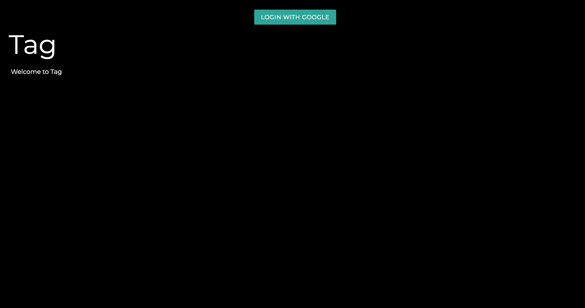

## Tag

### Overview

Welcome to Tag, a version control application for creative collaboration!

With tag, you can collaborate on articles, scripts, stories and more with as many collaborators as you like.

To start, simply log in with Google.

From here, you can view any projects you may already have, including projects collaborators may have added you on. You can also create a new project.

You can view your project by clicking the link on your Projects page. From here, you can add content to your project, submit edits, view previous versions, and add collaborators to your project.

When working on a project with collaborators, each edit must be reviewed by all collaborators for approval. You can tell when a project has pending approvals by the yellow warning icon next to the project’s name, and by the fact that a project with pending approvals cannot be edited.

If all collaborators on a project approve an edit, that edit becomes the project’s master version, and the project can once again accept edits.

If any collaborator on a project rejects an edit, the document reverts to the previous version.

Enjoy!

---
### Technologies Used

Tag is a full-stack application built with MongoDB, Express, and Node.js, with Embedded JavaScript files and Materialize to build the views.

Node modules include Mongoose for object modeling, and Oauth and Passport for authentication.

The app's data is hosted on MongoDB Atlas, and the app is deployed on Heroku.

Full Technology List:
 
HTML | CSS | JavaScript | Node.js | jQuery | MongoDB | Mongoose | Express.js | EJS | Materialize | Oauth2 | Passport.js | MongoDB Atlas | Heroku

---
### Getting Started
<a href="https://tag-app-md.herokuapp.com/"> Check out the deployed app on Heroku.</a>

<a href="https://trello.com/b/7n53hBSR/tag">And take a look at the Trello board I used to develop it. </a>

---
### Next Steps

I would like to implement the following next steps:

1. Allow users to see who submitted an edit.
2. Allow users to accept or reject a project invitation.
3. Display pending edits in a different color.